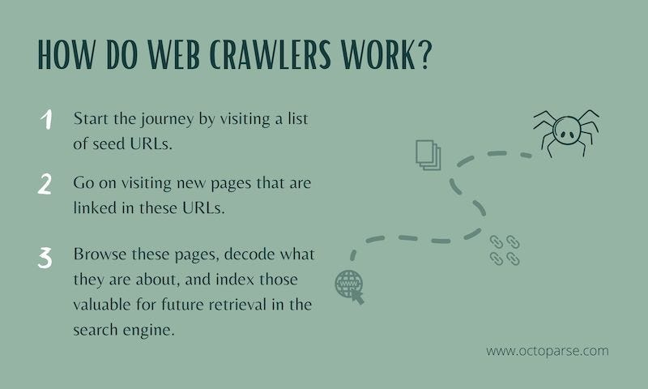

::: {style="text-align: justify;"}

# Introduction
Web crawling has become essential for search engines and AI applications. The integration of these technologies has been explored extensively [@smith2020web]. The growth of digital content has placed significant demands on the efficiency and accuracy of web crawlers and artificial intelligence (AI) models. In response, Content Lifecycle Management Standards (CLMS) are essential for establishing uniformity in the way data is formatted, structured, and exposed for automated tools like crawlers and AI training datasets. CLMS helps ensure that content is easy to access, interpret, and process, leading to more accurate information retrieval and AI model training. This document outlines the development of CLMS standards for exposing information to web crawlers and optimizing the formatting for AI data ingestion. @fig-ai-training focuses on the AI training workflow.

{width=60% align="center" #fig-ai-training}


## Background

Web crawlers and AI models are tasked with retrieving and processing enormous amounts of data from the web. However, the efficiency of these processes often suffers from the lack of a consistent data format, making it difficult to retrieve and interpret information at scale. Properly structured and formatted content improves both crawling and training processes by ensuring that key information is readily identifiable and accessible.

CLMS provides a framework for standardizing the way data is created, stored, and exposed across different platforms. By adhering to CLMS, organizations can improve the quality and accessibility of their data for web crawlers and AI systems alike.

## AI and Web Crawlers

The relationship between AI and web crawlers has led to new frontiers in both industries [@jones2019ai].

## Best Practices for CLMS Implementation

:::{.callout-note}
Make sure to include structured metadata in all web pages to enhance crawling efficiency.
:::

:::{.callout-warning}
Ensure that content is updated regularly; outdated information may negatively impact SEO performance.
:::

:::{.callout-tip}
Consider using a sitemap to guide web crawlers through your website's structure efficiently.
:::

:::{.callout-important}
Structured data is key for AI training models, especially when processing large datasets.
:::

:::{.callout-caution}
Avoid using non-standard data formats, as this can reduce the effectiveness of both web crawlers and AI training.
:::

:::{.callout-example}
Here is an example of how to structure your metadata for optimal performance:
```yaml
---
title: "Optimized Web Crawling"
author: "John Doe"
date: "2024-09-10"
keywords: ["web crawling", "SEO", "AI training"]
---
```

## Motivation for CLMS Standards

The primary motivation for creating CLMS standards lies in the need for:
- **Improved Crawling Efficiency**: Properly formatted content with metadata helps crawlers index relevant information faster and more accurately.
- **Better AI Model Training**: Consistent content structure ensures that AI models are trained on high-quality, organized data.
- **Data Accessibility**: Standardizing the structure of content ensures that information is universally accessible across platforms.

Key aspects include:
- Uniform metadata
- Clearly defined content sections (e.g., titles, headings, subheadings)
- Embedded structured data formats (e.g., JSON-LD, RDF)

# Developing CLMS Standards

Developing CLMS standards requires collaboration between content creators, data engineers, and AI researchers. The process typically follows these stages:

## Content Structuring
Content structuring involves organizing data into recognizable, standard components, such as:
- **Title**: Main identifier of the content.
- **Metadata**: Information about the content, including authors, dates, keywords, and relevant classification.
- **Headings and Subheadings**: Structured sections that break down the content into digestible parts.

### Example of Metadata Formatting:
```yaml
---
title: "Web Crawlers and AI Training"
author: "Jane Doe"
date: "2024-09-10"
keywords: ["web crawling", "AI training", "CLMS"]
---
```

# Conclusion
In conclusion, the development of standards like CLMS can improve the efficiency of both web crawlers and AI training models by providing structured content.

:::

### **Description of the Sections:**
1. **Introduction**: Provides an overview of the importance of CLMS (Content Lifecycle Management Standards) in improving the ability of web crawlers and AI systems to process and retrieve data.
2. **Background**: Explains the problem of inconsistent data formatting and the need for CLMS standards in web crawling and AI training.
3. **Motivation for CLMS Standards**: Discusses the motivations for standardizing data formats, such as improved crawling efficiency, AI training quality, and overall data accessibility.
4. **Developing CLMS Standards**: Explains how to create standardized formats for metadata, headings, structured data, and sitemaps. Includes examples of metadata, JSON-LD, and sitemaps for web crawlers.
5. **Implementing CLMS Standards in Web Development**: Outlines practical steps for organizations to implement CLMS standards, such as training teams and automating processes for consistency.
6. **Challenges and Considerations**: Discusses the potential challenges organizations may face when adopting CLMS standards, and how to overcome them.
7. **Conclusion**: Summarizes the key points and emphasizes the long-term benefits of adopting CLMS standards for data accessibility and AI training.

This Quarto Markdown file provides a structured approach to documenting the development of CLMS standards, ensuring content is easily accessible by both web crawlers and AI systems.


# Monthly Sales Report

This report provides an analysis of the sales data over several months. The data is analyzed using Python libraries such as Pandas and Matplotlib.

The objective is to visualize trends and generate insights into sales performance over the first quarter of the year.

import pandas as pd
import matplotlib.pyplot as plt

# Sample sales data
data = {
    'Month': ['January', 'February', 'March', 'April', 'May'],
    'Sales': [1000, 1500, 1300, 1800, 2200]
}

# Create a DataFrame
df = pd.DataFrame(data)

# Plot the sales data
plt.plot(df['Month'], df['Sales'], marker='o')
plt.title('Monthly Sales Analysis')
plt.xlabel('Month')
plt.ylabel('Sales')
plt.grid(True)
plt.show()

## Sales Data Table

The table below shows the raw sales data for each month in the first quarter:

| Month     | Sales ($) |
|-----------|-----------|
| January   | 1000      |
| February  | 1500      |
| March     | 1300      |
| April     | 1800      |
| May       | 2200      |

The data shows an upward trend in sales, with a significant increase in April and May.
